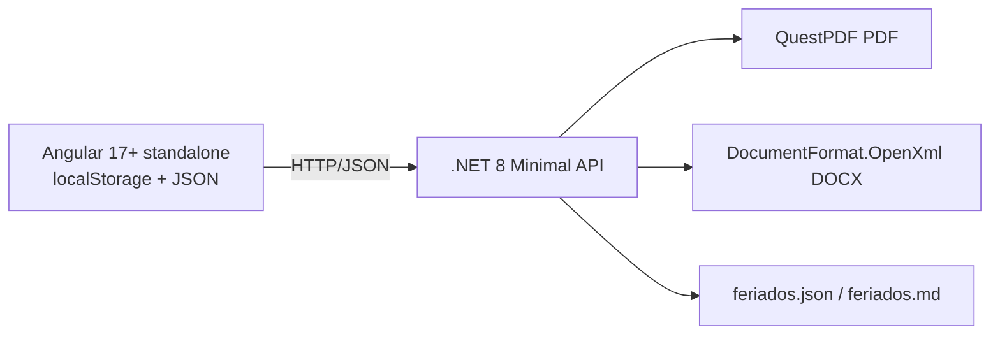

# 0001. Stack y arquitectura para generador de reportes biométricos falsos

## Contexto

El usuario necesita una aplicación fullstack simple que genere **reportes biométricos falsos** con la misma estructura visual y de datos de la app existente en `biometric_sistem_reports`. La app original está construida en Python/Flask, genera PDF con ReportLab y Word con python-docx, y usa PostgreSQL. El usuario quiere poder configurar reportes por persona, eliminar días concretos y que los reportes sean muy configurables. Su stack preferente es .NET (C#) + Angular. Tras analizar la viabilidad, se descartó una base de datos relacional porque el objetivo es un generador de reportes netamente.

## Decisión

Usamos **.NET 8 Minimal API** como backend, **Angular 17+ standalone** como frontend, **sin base de datos relacional**. El estado principal se guarda en el navegador (`localStorage`) con import/export a JSON. Los **feriados** se almacenan en un archivo simple del servidor (`feriados.json` o `.md`). La generación de documentos usa **QuestPDF** para PDF y **DocumentFormat.OpenXml** para Word.

## Alternativas consideradas

### A. Python/Flask réplica directa *(descartada)*
- **Pros:** reutiliza `script.py` y `script_docx.py` casi sin cambios; menor esfuerzo para imitar fielmente los reportes.
- **Contras:** no usa el stack preferido del usuario; frontend con Jinja2/Bootstrap en lugar de Angular.
- **Razón de descarte:** el usuario prioriza .NET/Angular y quiere una app nueva, no un fork.

### B. .NET Web API + Angular + PostgreSQL *(descartada)*
- **Pros:** robusto, escalable, mismo modelo relacional que la app original.
- **Contras:** excesivo para un generador de reportes; requiere instalar y configurar PostgreSQL localmente.
- **Razón de descarte:** una base de datos relacional no aporta valor si el objetivo es solo generar documentos.

### C. .NET Minimal API + Angular + SQLite *(descartada)*
- **Pros:** stack preferido, backend mínimo, SQLite no requiere servidor.
- **Contras:** agrega complejidad de persistencia innecesaria; los datos son volátiles por naturaleza (reportes falsos/configurables).
- **Razón de descarte:** el usuario prefiere archivos JSON/.md y no quiere una base de datos para el estado principal.

### D. .NET Minimal API + Angular sin DB, estado en localStorage + feriados en archivo *(elegida)*
- **Pros:** stack preferido, sin dependencias de base de datos, estado portable vía JSON, feriados editables como archivo, reportes altamente configurables.
- **Contras:** el estado no se comparte entre navegadores/dispositivos; hay que reescribir la lógica de análisis desde Python a C#.

## Consecuencias

- **Positivas:** MVP muy ágil; cero setup de base de datos; configuración portable; formato PDF/Word de alta fidelidad con QuestPDF y OpenXml; feriados fáciles de editar.
- **Negativas / costos:** se abandona el código original de generación de documentos; se debe replicar manualmente la estructura visual y las reglas de negocio.
- **Riesgos a vigilar:** fidelidad visual de los reportes respecto a los originales; manejo de fechas/horarios en C#; complejidad de OpenXml para tablas con estilos; tamaño del estado en `localStorage` si hay muchas personas.

## Configurabilidad de reportes

El frontend permitirá configurar al menos:

- Qué secciones incluir (tardanzas, ausencias, excesos de almuerzo, salidas anticipadas, registros anómalos, cumplimiento de horas).
- Umbrales de tardanza (leve/severa) y exceso de almuerzo.
- Colores corporativos, título, subtítulo, nombre de institución y disclaimer.
- Días excluidos por persona o globales.
- Justificaciones por fecha/persona.
- Feriados cargados desde archivo.

## Plan de salida

Si más adelante se necesita persistencia compartida o multi-usuario, se puede agregar un backend con PostgreSQL/SQL Server sin cambiar el modelo de dominio. Si QuestPDF no alcanza la fidelidad deseada, se evalúa DinkToPdf (HTML→PDF) o generación desde plantillas. Si el esfuerzo de replicar la lógica en C# es excesivo, se reconsidera la opción A (Python/Flask) como implementación intermedia.

## Referencias

- App original analizada: `/home/joeman/Documents/istpet-dev/biometrico/biometric_sistem_reports/`
- Librerías: [QuestPDF](https://www.questpdf.com/), [DocumentFormat.OpenXml](https://github.com/dotnet/Open-XML-SDK)

## Diagrama

